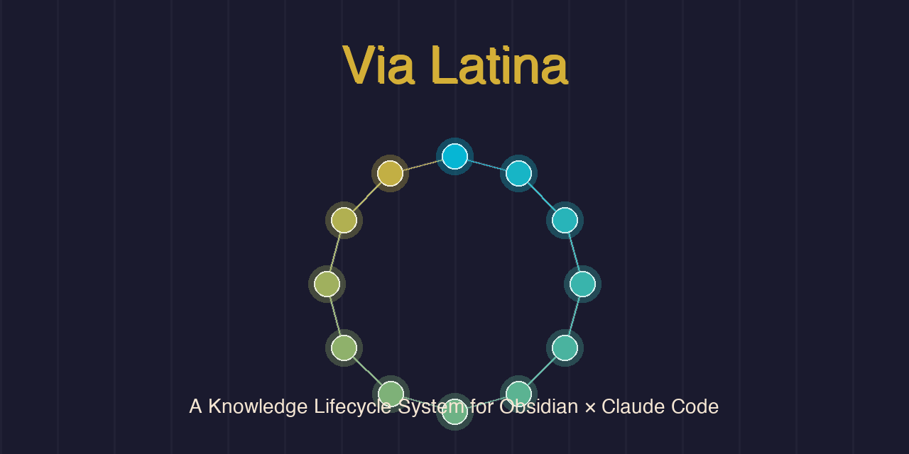

<p align="center">
  
</p>

<h3 align="center">A Knowledge Lifecycle System for Obsidian × Claude Code</h3>

<p align="center">
  12 interconnected skills that manage the full lifecycle of knowledge — from capture to archive.
</p>

<p align="center">
  <a href="#installation">Install</a> · <a href="#skills">Skills</a> · <a href="#pipeline">Pipeline</a> · <a href="#latin-callouts">Latin Callouts</a> · <a href="docs/architecture.md">Architecture</a>
</p>

---

## What is Via Latina?

Via Latina is an integrated skill ecosystem for [Claude Code](https://code.claude.com) that turns [Obsidian](https://obsidian.md) into a full knowledge lifecycle manager. Instead of isolated skills that do one thing, Via Latina skills **orchestrate together** — collecting knowledge, refining it, managing projects through their entire lifespan, and auditing quality.

Every skill is named in Latin, following the classical tradition of naming systems after their purpose.

### Why This Exists

Most Claude Code skills are standalone utilities. Via Latina is different:

- **Pipeline orchestration** — `purgatio` detects Latin callouts and hands off to `commentatio`, which can trigger `elevatio` to create projects
- **Full project lifecycle** — Create → Pending → Suspend → Merge → Archive → Revive (6 state transitions, zero data loss)
- **Self-auditing** — `tentatio` validates vault-wide consistency and evolves its own checks
- **Shared data model** — `_common/references/` ensures all 12 skills speak the same language

---

## Skills

### Core Pipeline

| Skill | Latin | Role |
|-------|-------|------|
| **indagatio** | *investigation* | Ingest external sources (URLs, PDFs, repos) into structured quick notes |
| **purgatio** | *purification* | Batch-process quick notes: refine, route, split for atomicity |
| **commentatio** | *commentary* | Synthesize annotations from [Latin callouts](#latin-callouts) |

### Project Lifecycle

| Skill | Latin | Role |
|-------|-------|------|
| **elevatio** | *elevation* | Promote a note into a full project with numbered folder structure |
| **memorio** | *memory* | Archive completed projects with validated reasoning |
| **dilatio** | *delay* | Move projects to Pending when waiting for external triggers |
| **suspensio** | *suspension* | Pause projects by internal decision (motivation, priority shift) |
| **vivificatio** | *revival* | Restore projects from Archive, Pending, or Someday |
| **unio** | *union* | Merge two projects into one, absorbing the secondary |
| **locatio** | *placement* | Group unprocessed notes by topic and place on hold |

### Quality & Review

| Skill | Latin | Role |
|-------|-------|------|
| **tentatio** | *testing* | Vault-wide quality audit with self-evolution analysis |
| **retrospectio** | *looking back* | Generate weekly/monthly review documents |

---

## Pipeline

```
                    ┌─────────────────────────────────────────┐
                    │            KNOWLEDGE LIFECYCLE           │
                    └─────────────────────────────────────────┘

  ┌───────────┐    ┌───────────┐    ┌─────────────┐    ┌───────────┐
  │ indagatio │───▶│ purgatio  │───▶│ commentatio │───▶│ elevatio  │
  │ (collect) │    │ (refine)  │    │ (annotate)  │    │ (create)  │
  └───────────┘    └─────┬─────┘    └─────────────┘    └─────┬─────┘
        ▲                │                                    │
        │                ▼                              ┌─────┴─────┐
        │          ┌───────────┐                        │  PROJECT  │
        │          │  locatio  │                        │   STATES  │
        │          │  (hold)   │                        ├───────────┤
        │          └───────────┘                        │ memorio   │
        │                                               │ dilatio   │
        │                                               │ suspensio │
  ┌─────┴──────────────────────────────┐                │ vivific.  │
  │  retrospectio ◀── tentatio         │                │ unio      │
  │  (reflect)        (audit)          │                └───────────┘
  └────────────────────────────────────┘
              feedback loop
```

---

## Installation

### Quick Install

Copy all skills to your Claude Code skills directory:

```bash
git clone https://github.com/catallactics/via-latina.git
cp -r via-latina/skills/* ~/.claude/skills/
```

### Latin Callouts (Optional)

To enable styled callouts in Obsidian, copy the CSS snippet:

```bash
cp via-latina/extras/obsidian-css/latin-callouts.css \
   /path/to/your/vault/.obsidian/snippets/
```

Then enable it in Obsidian: **Settings → Appearance → CSS Snippets**.

### Recommended Vault Structure

Via Latina works best with a numbered folder hierarchy. See [docs/vault-setup.md](docs/vault-setup.md) for the recommended structure, or adapt the `_common/references/vault-structure.md` to match your existing vault.

---

## Latin Callouts

Via Latina introduces 6 custom Obsidian callout types used by `commentatio` for annotation-driven workflows:

| Callout | Latin | Purpose | What happens |
|---------|-------|---------|-------------|
| `[!quaero]` | *I ask* | Questions | WebSearch + answer with sources |
| `[!emendo]` | *I improve* | Suggestions | Specific improvement applied |
| `[!disco]` | *I learn* | Study items | Learning roadmap + keywords |
| `[!facio]` | *I do* | Actions | Converted to task items |
| `[!moneo]` | *I remind* | Highlights | Vault connections surfaced |
| `[!cogito]` | *I think* | Musings | Expanded with related ideas |

**Usage in Obsidian:**

```markdown
> [!quaero] What is the difference between Hyperreality and Simulacra?

> [!facio] Research competitor pricing models

> [!cogito] This reminds me of how DAWs handle non-destructive editing...
```

When `purgatio` processes notes, it detects these callouts and routes them to `commentatio` for synthesis.

---

## Shared Data Model

All skills share a common reference system in `_common/references/`:

| File | Purpose |
|------|---------|
| `frontmatter-standard.md` | Status lifecycle taxonomy (12 valid statuses) |
| `type-standard.md` | Note type taxonomy (25 valid types) |
| `vault-structure.md` | Recommended folder hierarchy |
| `logging-standard.md` | Activity logging format |
| `registry-format.md` | Project numbering and registry |
| `child-frontmatter-update.md` | Batch frontmatter sync protocol |

This shared model ensures consistency across all 12 skills — every skill writes metadata the same way, routes files to the same folders, and logs activity in the same format.

---

## Key Patterns

### Self-Check (indagatio)
After processing, indagatio asks: *"Is this more comprehensive than what I'd get manually? Did I discover something the user didn't know?"* If not, it re-expands scope automatically.

### Self-Evolution (tentatio)
The audit skill detects gaps in its own coverage — uncovered folders, unvalidated fields, unregistered checks — and suggests new audit rules.

### Scale-Triggered Behavior (indagatio, purgatio)
The same source gets different treatment based on size: Small (quick summary), Medium (link crawl, structured overview), Large (comprehensive breakdown with hierarchical batching).

### Dual-Mode Operation (purgatio)
Runs in full mode (user-triggered, modifies vault) or report-only mode (called by other skills, appends to daily log without changes).

---

## Contributing

See [CONTRIBUTING.md](CONTRIBUTING.md) for guidelines.

**Short version:** PRs welcome for new skills that follow the Latin naming convention and integrate with the existing pipeline. Bug reports and workflow suggestions are appreciated.

---

## License

MIT — see [LICENSE](LICENSE).
